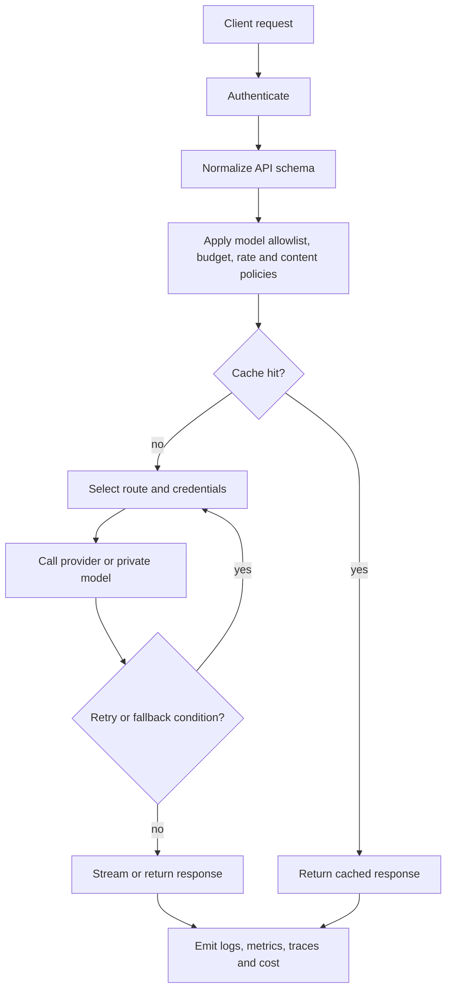

A production request commonly follows this path:

## Required design decisions

- Does authentication happen before request-body parsing?
- Which errors trigger retries, and which trigger fallback?
- Can a fallback change the model family?
- Are streamed responses retried after partial output?
- Is cost based on provider usage fields, local tokenization, or estimates?
- Are prompts and outputs logged, redacted, hashed, or omitted?
- What happens when the telemetry sink is unavailable?
- Which policy version handled the request?

The request path should be deterministic enough to audit even when routing is dynamic.
